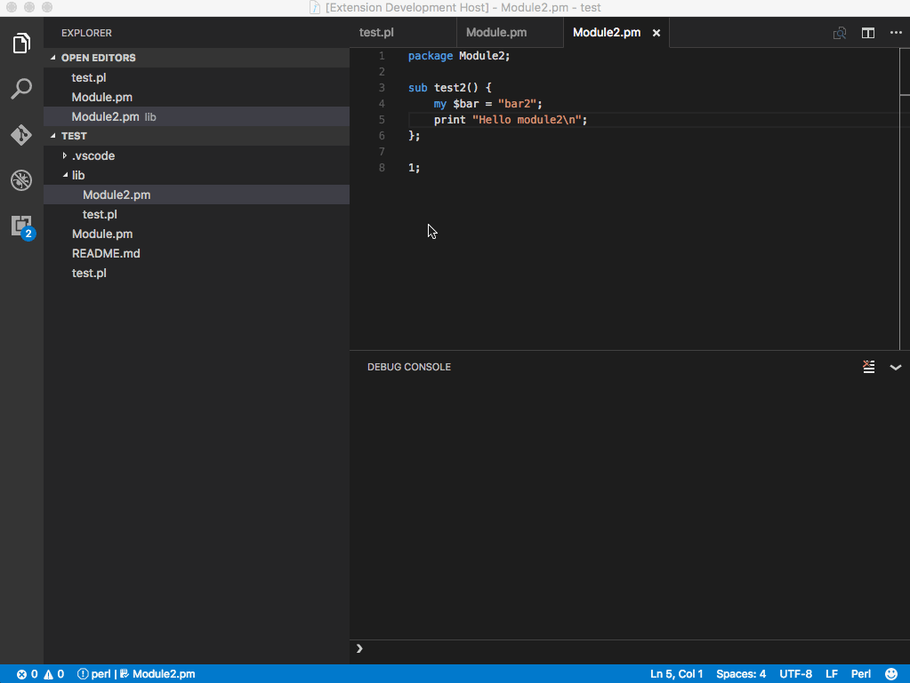

# VS Code Perl Debug
[](https://travis-ci.org/raix/vscode-perl-debug)
[](https://ci.appveyor.com/project/raix/vscode-perl-debug/branch/master)
[](https://greenkeeper.io/)
[](https://github.com/semantic-release/semantic-release)

A debugger for perl in vs code.



### Features

* Breakpoints *(continue, step over, step in, step out)*
* Stacktrace
* Variable inspection *(support for objects, arrays, strings, numbers and boolean)*
* Variable watching *(for now we don't create actual watch breakpoints - figuring out how to maintain t)*
* Setting new values of variables *(works inside of arrays and objects too)*
* Debug console for writing expressions *(write perl expressions in the debug console)*
* Variable values on hover in code
* Loaded modules view *(including source code retrieval from remote)*

### Settings

* `exec` Can be set to a specific perl binary *defaults to "perl"*
* `execArgs` Arguments that is passed to the binary perl executable
* `inc` Can be an array of strings / include paths
* `args` Can be an array of strings / program arguments
* `env` Used for setting environment variables when debugging, `PATH` and `PERL5LIB` default to system unless overwritten
* `trace` Boolean value to enable Debug Adapter Logging in `perl-debug.log` file
* `port` Number for port to listen for remote debuggers to connect to. *(Used only for remote debugging)*
* `console` String to identify where to launch the debuggee
* `debugRaw` Boolean to enable logging of raw I/O with the Perl debugger in an output channel

### Setup notes

You might have to install the `PadWalker` Perl package for variable inspection on Windows *(and some linux distributions?)*

A standard `launch.json` will resemble the following (on Windows, *nix distros will differ slightly.)

```json
    {
        "version": "0.2.0",
        "configurations": [
            {
                "type": "perl",
                "request": "launch",
                "console": "integratedTerminal",
                "exec": "C:/Perl64/bin/perl.exe",
                "execArgs": [],
                "name": "Perl Debug",
                "root": "${workspaceRoot}",
                "program": "${workspaceRoot}/${relativeFile}",
                "inc": [],
                "args": [],
                "stopOnEntry": true
            }
        ]
    }
```

### Remote debugger

When setting the `port` attribute in `launch.json` the vs code debug extension will start a debug server for the remote perl debug instance to connect to.

eg.:
```bash
 # Start remote debugger in vs code on port 5000 then:
 $ PERLDB_OPTS="RemotePort=localhost:5000" perl -d test.pl
```
*`localhost` should be replaced by the ip address*

### Stability

Tests matrix running between os and perl versions:

* OSX - perl 5.22
* OSX - perl 5.20
* OSX - perl 5.18
* OSX - perl 5.16
* OSX - perl 5.14
* Linux - perl 5.22
* Linux - perl 5.20
* Linux - perl 5.18
* Linux - perl 5.16
* Linux - perl 5.14
* Windows 64bit - Strawberry perl 5.24.1
* Windows 64bit - Strawberry perl 5.22.3
* Windows 64bit - Strawberry perl 5.20.3
* Windows 64bit - Strawberry perl 5.18.4
* Windows 64bit - Strawberry perl 5.16.3
* Windows 64bit - Activeperl 5.22.3.2204
* Windows 64bit - Activeperl 5.24.1.2402

Known issues on windows:

* "Restart" - `inhibit_exit` is not respected and will cause the debugger to stop
* Variable inspection unstable - it's due to output inconsistency from the perl debugger

If you want to help test / debug read [DEBUGGING.md](DEBUGGING.md)

### Todo

* Watching variables doesn't create actual expression watchers yet - need more api for actually maintaining the list of expressions to watch. I might be able to do a workaround for now.
* Variable values on hover doesn't work all the time due to the lack of info, eg. `$obj->{ownObj}->{ownFoo}` hovering over `$obj` will work fine - but the children are not parsed correctly - to solve this we might need to parse the line of code.

### Credits

Credits goes to Microsoft for making an awesome editor and a nice getting started mock debugger: [https://github.com/Microsoft/vscode-mock-debug.git](https://github.com/Microsoft/vscode-mock-debug.git)


### Reporting issues and feature requests

I don't care about stars, but for everybodys sake:
Please use github for tracking issues and feature requests, thanks!

When you report an issue, it can be very helpful to enable `debugRaw`
in your launch configuration. When enabled, you should have an output
channel named `Perl Debug RAW` with contents like:

```json
["2019-03-02T21:49:50.230Z","perl-debug.streamcatcher.write","127.0.0.1:40133 serving 127.0.0.1:43320","p $]\n"]
["2019-03-02T21:49:50.231Z","perl-debug.streamcatcher.data","127.0.0.1:40133 serving 127.0.0.1:43320","5.028001"]
...
```

These are the raw commands sent to the `perl5db.pl` debugger and the
responses received. Including these in your report can make it easier
to track down version differences and portability problems.

I do take pull requests for both documentation and code improvements!

Please be aware that this plugin depends on the OS/vs code/perl distribution/perl5db.pl
and none of these are perfect/consistent dependencies, therefor hard to track down.
*Why I've added a fairly broad test matrix across os/perl distributions*

Please keep in mind that I'm an ES developer, I don't know all
the corners of perl - so any help is appriciated.

This project is using `semantic release` and `commitlint` for vs code extensions.
*Commit messages should be formatted accordingly and should trigger correct*
*versioning and automatic release / publish in the extension gallary.*

Kind regards

Morten
